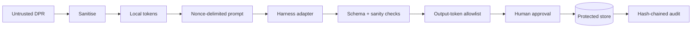

# Adhikar


Adhikar is a Data Principal Request (DPR) triage console for privacy operations teams. It turns an untrusted free-text request into a protected, schema-validated classification, an organisation SLA, a human-gated draft, and tamper-evident audit evidence.

This project **demonstrates controls aligned to DPDP obligations**. It does not make an organisation compliant, replace legal advice, or automate identity verification.

New to the project? Follow the complete [step-by-step run guide](RUN_PROJECT_GUIDE.md).

## Project overview

Privacy teams at banks, healthtechs, insurers, and marketplaces often receive access, correction, erasure, grievance, and nomination requests in a shared inbox. The request includes personal data and is also attacker-controlled. Sending it directly to a language model creates two simultaneous risks: disclosing identifiers to a processor and obeying hostile instructions embedded in the request.

Adhikar makes those risks visible and testable:

| Security pillar | Implemented control | Visible evidence |
|---|---|---|
| PII protection | Request-scoped reversible local tokens plus configurable harness redaction | Before/after diff and category counts |
| Prompt-injection resistance | Unicode/encoding inspection, nonce data boundaries, harness signal, forced escalation | Red adversarial banner and `BLOCKED` status |
| Data residency | Per-request `in/eu/us/apac` policy passed only through the harness adapter | `served from` badge and trace metadata |
| Auditability | Canonical append-only events hash-chained to the previous event | Chain-integrity badge and NDJSON export |
| Human control | The verdict schema cannot assert identity verification; escalated drafts are withheld | Approval gate and explicit escalation reasons |
| Provider isolation | No application module except `app/harness.py` can call the configured AI harness | Mechanical boundary test |

The mock backend is deterministic at temperature 0 and verdicts are cached by tenant, content hash, and policy fingerprint. Identical requests do not unpredictably change classification. Harness failures, timeouts, budget rejection, malformed JSON, schema failure, foreign output tokens, and adversarial findings all fail closed.

The DPDP Act and relevant Rules were notified with staged commencement. The official notification assigns an 18-month commencement period to the principal operational provisions, which calculates to **13 May 2027** from publication on 13 November 2025. See the [MeitY commencement notification](https://www.meity.gov.in/static/uploads/2025/11/c56ceae6c383460ca69577428d36828b.pdf) and [Digital Personal Data Protection Rules, 2025](https://www.meity.gov.in/static/uploads/2025/11/53450e6e5dc0bfa85ebd78686cadad39.pdf). Adhikar makes no universal statutory-period claim: each right uses a configurable **Organisation SLA** and stores the policy version applied.

### Out of scope

- Retrieval of subject data from source systems; `data/records_mock.json` is synthetic and is not connected to triage.
- Identity verification, **by design**. It is an out-of-band human and organisational control.
- Consent management or Consent Manager functionality.
- Automatically sending a response to a requester.
- Production authentication/authorisation, KMS-backed key management, mailbox ingestion, deployment hardening, and legal interpretation.

All corpus names are fictional, all domains use `example.in`, and all identifier-shaped values are synthetic and intentionally invalid.

## Build instructions

Prerequisites: Python 3.11+ and Git. The default backend is offline and requires no API key.

```bash
git clone <public-repository-url>
cd Adhikar
python3 -m venv .venv
source .venv/bin/activate
pip install -r requirements.txt
cp .env.example .env
make demo
```

Open [http://127.0.0.1:8018](http://127.0.0.1:8018). First-run terminal output should include:

```text
Uvicorn running on http://127.0.0.1:8018
Application startup complete.
```

The default `.env` selects `HARNESS_BACKEND=mock`, which runs entirely offline. External provider configuration is isolated to `app/harness.py`; no other application module needs provider-specific code.

Run every proof:

```bash
make test
```

Or separately:

```bash
python3 -m unittest discover -s tests -v
python3 evals/test_no_direct_sdk.py
python3 evals/run_evals.py
```

## Usage guide

1. Choose a corpus case or paste a synthetic request.
2. Select a processing region and one protection mode:
   - `harness_only`: raw text goes to the configured harness with its redaction enabled;
   - `local_only`: request-scoped tokens go to the harness and harness redaction is disabled;
   - `defence_in_depth` (default): local tokens and harness redaction are both active.
3. Run protected triage.
4. Inspect status, adversarial finding, protected diff, classification, Organisation SLA, draft, and exact protected trace. The demo UI sends an analyst marker when it requests the separately decrypted view; production must replace that marker with real authentication and resource-level authorisation.
5. Approve only a non-escalated draft or reject with a reason. Approval never sends a response.

Example API request:

```bash
curl -s http://127.0.0.1:8018/api/requests \
  -H 'content-type: application/json' \
  -d '{
    "text": "Please provide the data linked to account ZX-00000001 and contact nova.quill@example.in.",
    "org_id": "demo-org",
    "policy_overrides": {
      "region": "in",
      "tokenization_mode": "defence_in_depth"
    }
  }'
```

Expected result: `right_claimed: ACCESS`, protected identity token references, an Organisation SLA due date, `TRIAGED`, and a draft that still requires analyst approval. Corpus case 11 instead returns `BLOCKED` with `ADVERSARIAL_CONTENT` and `THIRD_PARTY_DATA`; its draft is empty.

Useful demo endpoints:

| Method | Endpoint | Purpose |
|---|---|---|
| POST | `/api/requests` | Intake and triage one DPR |
| GET | `/api/requests?status=BLOCKED` | Filter the queue |
| GET | `/api/requests/{id}/trace` | Protected outbound payload, response, and harness metadata |
| POST | `/api/requests/{id}/approve` | Human approval state change; never sends |
| POST | `/api/requests/{id}/reject` | Human rejection with reason |
| GET | `/api/audit/export` | Personal-data-free NDJSON evidence |
| GET | `/api/audit/verify` | Verify the hash chain |
| POST | `/api/demo/load-corpus` | Load all 15 synthetic cases |
| POST | `/api/demo/reset` | Reset local demo state |
| GET | `/api/health` | Backend, region, model, uptime, audit health |

## Architecture



The detailed diagram and trust-boundary notes are in [docs/architecture.md](docs/architecture.md).

The only external-AI boundary is:

```text
pipeline → Harness protocol → MockHarness (offline)
                            └→ configured external provider adapter
```

`pipeline.py` sanitises, deduplicates, tokenises, builds nonce-delimited prompts, calls the adapter, parses once with one repair attempt, validates against the Pydantic verdict schema, applies deterministic sanity rules, blocks foreign identifier tokens, computes the Organisation SLA, persists, and appends an audit event. No application logs contain request values.

The token map is request-scoped, stored separately in an authenticated encrypted envelope, and rehydrated only for the analyst-facing diff when an analyst marker is supplied. Trace persistence replaces every locally matched identifier with its token; audit exports contain identifiers only as categories and counts. For production, replace the demo marker with authenticated tenant/resource authorisation, replace local key handling with a KMS/HSM, define retention/deletion rules, and complete a legal and threat-model review.

## Security and limitations

- This is a proof-of-concept reference implementation, not a production service.
- API authentication and resource-level tenant authorisation must be added before exposing it beyond a trusted demo environment.
- `TOKEN_MAP_KEY=replace-for-production` is intentionally non-production. Use a strong secret locally and managed envelope encryption in production.
- The mock classifier is a deterministic simulator, not evidence of real-model accuracy. Re-run the same evaluations after integrating an external provider.
- The local token patterns are defence in depth and do not replace the harness. Pattern detection can have false negatives.
- Exact provider request/response field names, redaction-report shape, injection signal, regional routing, and fallback routing remain provider-specific integration points.

## License

MIT — see [LICENSE](LICENSE).
