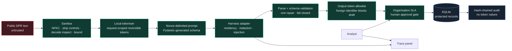

# Architecture

## Trust boundaries

The public request is attacker-controlled. Sanitisation and local tokenisation occur before the harness boundary. Only `app/harness.py` can perform a network call to the configured AI harness, and `evals/test_no_direct_sdk.py` enforces that source boundary. Harness output remains untrusted until JSON parsing, Pydantic validation, sanity checks, and an output-token allowlist all succeed.

Identity verification is a separate human/process boundary. The verdict schema has no `verified` field, so a model cannot assert verification even if hostile text asks it to.

## Data storage

Request rows contain a SHA-256 content hash, locally matched identifiers replaced with tokens, verdict tokens, SLA policy version, and security metadata. Token values are placed in a separate table using an authenticated encrypted envelope keyed by `TOKEN_MAP_KEY`. The implementation is suitable for a synthetic hackathon demo; a production deployment should replace the local key with a managed KMS/HSM-backed envelope encryption service and add authenticated analyst access.

Audit events contain request IDs, actor IDs, token categories/counts, residency and model metadata, never token values. Each canonical event includes the preceding event hash.

## Failure behaviour

Timeouts, exhausted retries, provider errors, cost-cap rejection, invalid JSON, or schema drift all create `NEEDS_HUMAN_REVIEW` records with no draft. Injection and third-party requests create `BLOCKED` records. No response is sent automatically.
